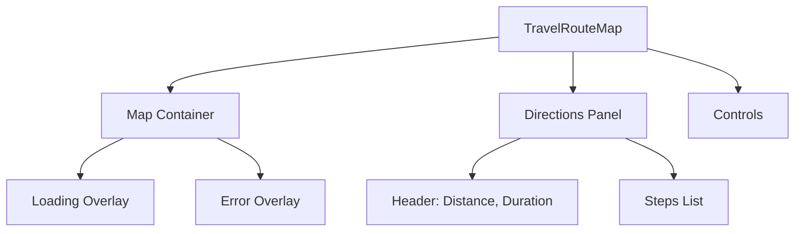

# Travel Route Component Design Specification

## Overview
組件用於顯示從機場到飯店的旅行路線，使用 Google Maps。

## Integration
新增一個新標籤 "Transport" 在底部導航中，圖標為 fa-route 或類似。

在 trip-info 標籤中顯示組件，如果有資料。

## Component Props
```typescript
interface TravelRouteMapProps {
  origin?: { lat: number; lng: number; name?: string };
  destination?: string | { lat: number; lng: number; name?: string };
  travelMode?: google.maps.TravelMode;
}
```

## Component Structure


## Display Information
- 地圖：路線折線、起點/終點標記
- 面板：總距離、總持續時間、逐步指示（指示、距離、持續時間）

## User Interactions
- 地圖：原生縮放/平移
- 控制項：縮放按鈕、切換面板

## Responsive Design
- 手機：面板底部覆蓋，高度 50%
- 桌面：側邊面板，寬度 300px

## Error Handling
- 缺少資料：顯示 "請先添加航班和飯店資訊"
- API 失敗：顯示 "無法獲取路線，請檢查網路"

## Loading States
- 載入中：地圖上覆蓋旋轉器

## Integration Points
- 從 currentTrip.flight.outArrivalAirport 獲取起點
- 從 currentTrip.hotel.address 獲取終點（需地理編碼）
- 使用 googleMaps.ts 工具